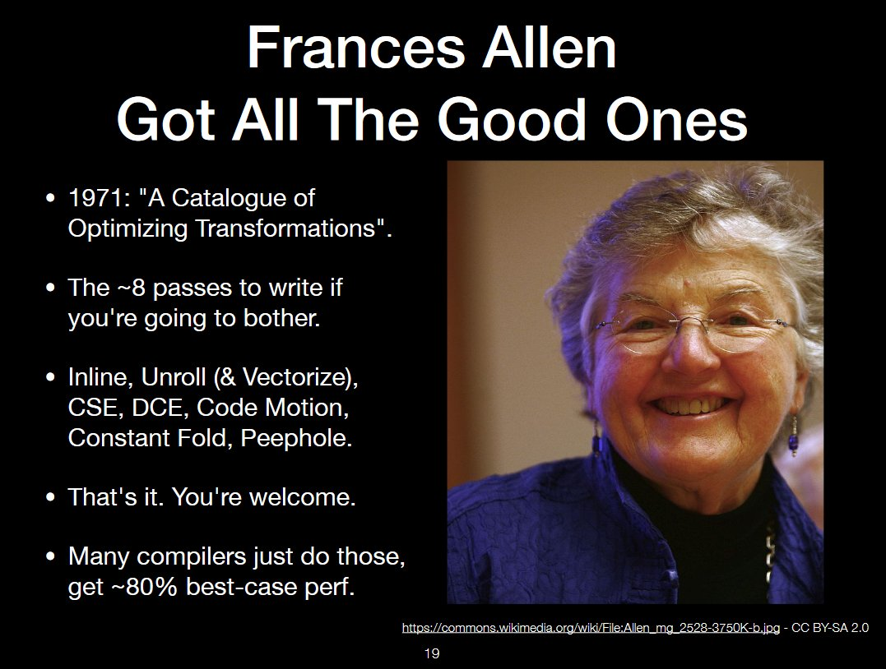

# tinyc


**a software 1.0 compiler: C89/90 -> RV32G**

```
tinyc is smoked with egos2k and xv6 and passes gcc's torture test suite.
tinyc is sped up with 20/80 optimizations to beat `gcc -O1` on dhrystone and embench.
proebsting's law prevents me from beating -O2/-O3.
```